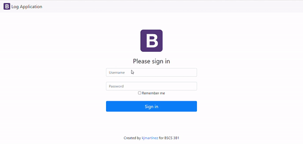

# **logApp**
During this pandemic, we usually encounter logbooks in almost every facility around the city. Under Republic Act 11469 or also known as Bayanihan to Heal as One Act, we, as good citizens, are mandated to provide our truthful personal information to logbooks whatnot. However, we cannot deny the fact that some people are hesitant to provide their personal information due to fear of personal information leakage that can be used for illegal activities such as scams and phishing. But nowadays, there are lots of advanced methods uniquely made for this situation in order to somehow avoid these happenings. One of the examples is an application log. This logApp is a sample application that logs the individual's personal information in which only users with an admin account can view the list of people who registered along with their personal information. 
# 
## **User Interface**
***Registrant's POV***
 

***Admin's POV***
 

 

#
## **How to work with phpMyAdmin?**
1. Click on New (1) to create a database and enter the database name in Create database (2) field and then click on Create (3) button. We can create any number of databases. 

2. Enter the table name, number of columns, and click on Go. A message will show that the table is created successfully.

3. Now enter the field name, type, their size, and any constraint here and save it.

4. The table is created successfully. We can make changes in the table from here.

#

## **Author**
 

 **Ricky P. Edradan Jr. :smirk:**

